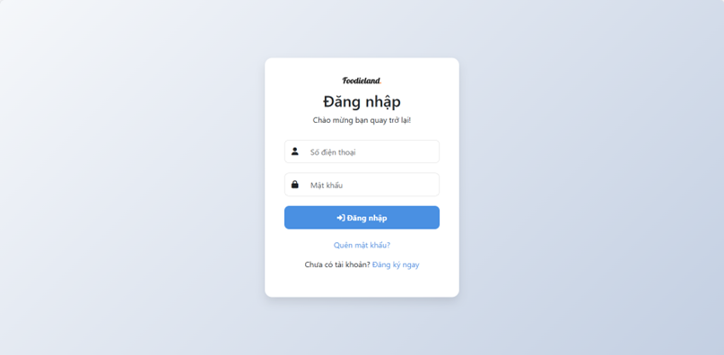
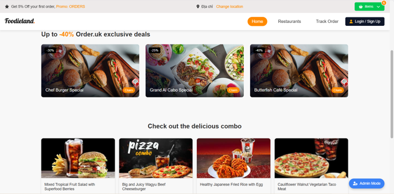
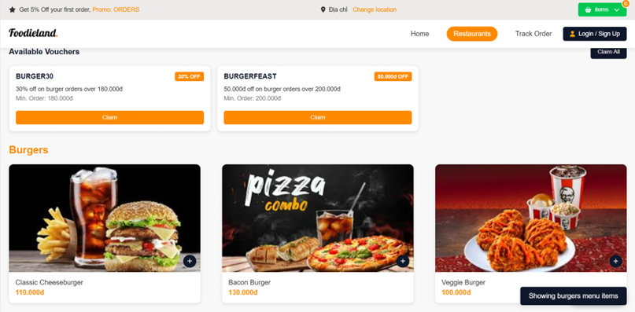
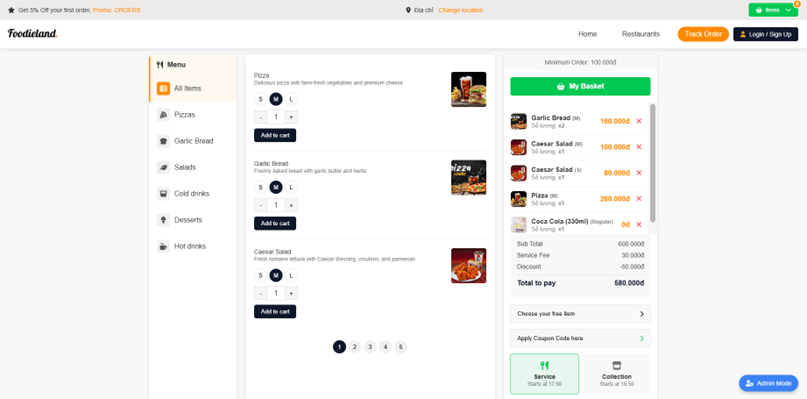
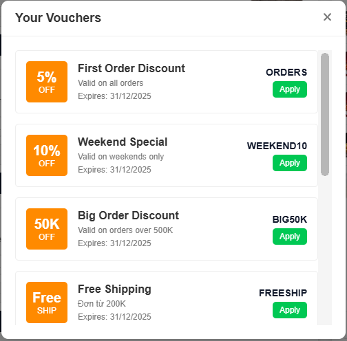
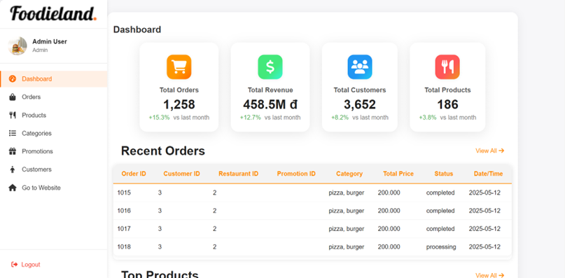

## Hệ thống Đặt Đồ Ăn Trực Tuyến - Foodieland

> **Dự án**: Nền tảng đặt đồ ăn trực tuyến với hệ thống quản lý nhà hàng toàn diện. Ứng dụng web full-stack với tính năng đặt món, thanh toán, quản lý đơn hàng real-time và dashboard quản trị viên đầy đủ.

---

## 🧠 MÔ TẢ HỆ THỐNG

**Foodieland** là một nền tảng đặt đồ ăn trực tuyến hiện đại giúp:
- **Khách hàng**: Duyệt menu, đặt món, theo dõi đơn hàng, áp dụng mã giảm giá
- **Nhà hàng**: Quản lý menu, theo dõi đơn hàng, cập nhật trạng thái
- **Quản trị viên**: Quản lý tổng thể hệ thống, khách hàng, sản phẩm, khuyến mãi

### Kiến trúc hệ thống:

```
Client (Browser) <--> Express.js Server <--> MSSQL Database
                         ├── JWT Authentication
                         ├── RESTful API
                         └── Socket.IO (Real-time)
```

### Sơ đồ luồng hoạt động:

```
┌─────────────────────────────────────────────────────────────────┐
│                        USER FLOW                                │
└─────────────────────────────────────────────────────────────────┘

┌──────────────┐
│  Trang chủ   │
│   (Home)     │
└──────┬───────┘
       │
       ├─────> [Chưa đăng nhập] ──> Đăng ký/Đăng nhập
       │                                    │
       └─────> [Đã đăng nhập] ─────────────┘
                                            │
                                            ▼
                                    ┌───────────────┐
                                    │  Browse Menu  │
                                    │  (Restaurant) │
                                    └───────┬───────┘
                                            │
                                            ▼
                                    ┌───────────────┐
                                    │  Chọn món ăn  │
                                    │  Thêm vào giỏ │
                                    └───────┬───────┘
                                            │
                                            ▼
                                    ┌───────────────┐
                                    │  Xem giỏ hàng │
                                    │  (My Basket)  │
                                    └───────┬───────┘
                                            │
                                            ├─> Áp dụng voucher
                                            │
                                            ▼
                                    ┌───────────────┐
                                    │  Chọn phương  │
                                    │  thức giao    │
                                    │  (Service/    │
                                    │   Collection) │
                                    └───────┬───────┘
                                            │
                                            ▼
                                    ┌───────────────┐
                                    │  Đặt hàng     │
                                    │  (Place Order)│
                                    └───────┬───────┘
                                            │
                                            ▼
                                    ┌───────────────┐
                                    │  Track Order  │
                                    │  Real-time    │
                                    │  WebSocket    │
                                    └───────────────┘

┌─────────────────────────────────────────────────────────────────┐
│                        ADMIN FLOW                               │
└─────────────────────────────────────────────────────────────────┘

                            ┌──────────────┐
                            │ Admin Login  │
                            └──────┬───────┘
                                   │
                                   ▼
                            ┌──────────────┐
                            │  Dashboard   │
                            │  - Orders    │
                            │  - Revenue   │
                            │  - Customers │
                            │  - Products  │
                            └──────┬───────┘
                                   │
                    ┌──────────────┼──────────────┬──────────────┐
                    │              │              │              │
                    ▼              ▼              ▼              ▼
            ┌───────────┐  ┌───────────┐  ┌───────────┐  ┌───────────┐
            │  Orders   │  │ Products  │  │Categories │  │Promotions │
            │Management │  │Management │  │Management │  │Management │
            └───────────┘  └───────────┘  └───────────┘  └───────────┘
                    │              │              │              │
                    └──────────────┴──────────────┴──────────────┘
                                   │
                                   ▼
                            ┌──────────────┐
                            │  Customers   │
                            │  Management  │
                            └──────────────┘
```

**Giải thích luồng hoạt động:**

**Luồng người dùng (User Flow):**
1. **Trang chủ**: Người dùng truy cập trang chủ, xem deals và combos đặc biệt
2. **Xác thực**: Đăng ký/Đăng nhập để sử dụng dịch vụ
3. **Duyệt menu**: Xem danh sách nhà hàng và menu món ăn theo danh mục
4. **Thêm giỏ hàng**: Chọn món, điều chỉnh số lượng, thêm vào giỏ
5. **Áp dụng voucher**: Nhập mã giảm giá hoặc chọn voucher có sẵn
6. **Chọn phương thức**: Chọn giao hàng (Service) hoặc đến lấy (Collection)
7. **Đặt hàng**: Xác nhận và đặt đơn hàng
8. **Theo dõi**: Theo dõi trạng thái đơn hàng real-time qua WebSocket

**Luồng quản trị (Admin Flow):**
1. **Đăng nhập Admin**: Xác thực với quyền admin
2. **Dashboard**: Xem tổng quan thống kê (đơn hàng, doanh thu, khách hàng, sản phẩm)
3. **Quản lý đơn hàng**: Xem, cập nhật trạng thái đơn hàng (processing, completed, cancelled)
4. **Quản lý sản phẩm**: Thêm/sửa/xóa món ăn, cập nhật giá, hình ảnh
5. **Quản lý danh mục**: Tổ chức món ăn theo category (Pizza, Burger, Salad, Drinks...)
6. **Quản lý khuyến mãi**: Tạo và quản lý mã giảm giá, voucher
7. **Quản lý khách hàng**: Xem thông tin khách hàng, lịch sử đơn hàng

---

## ⚙️ CÔNG NGHỆ SỬ DỤNG

| Thành phần | Công nghệ |
|:-----------|:----------|
| **Frontend** | HTML5, CSS3, Vanilla JavaScript |
| **Backend Framework** | Node.js, Express.js |
| **Database** | Microsoft SQL Server (MSSQL) |
| **Authentication** | JWT (JSON Web Tokens), bcryptjs |
| **Real-time Communication** | Socket.IO |
| **File Upload** | Multer (multipart/form-data) |
| **Security** | Helmet.js, CORS |
| **Logging** | Winston |
| **Validation** | express-validator |
| **API Architecture** | RESTful API |
| **Database Driver** | mssql (node-mssql) |

---

## 🚀 HƯỚNG DẪN CÀI ĐẶT VÀ CHẠY DỰ ÁN

### 1. Yêu cầu hệ thống
- Node.js 14.x trở lên
- Microsoft SQL Server 2019+ hoặc SQL Server Express
- npm hoặc yarn
- Git

### 2. Clone repository
```bash
git clone <repository-url>
cd Web
```

### 3. Cài đặt dependencies

**Backend:**
```bash
cd backend
npm install
```

**Dependencies chính:**
```json
{
  "express": "^4.18.2",
  "mssql": "^11.0.1",
  "jsonwebtoken": "^9.0.0",
  "bcryptjs": "^2.4.3",
  "socket.io": "^4.6.1",
  "multer": "^1.4.5-lts.1",
  "winston": "^3.8.2",
  "helmet": "^6.0.1",
  "cors": "^2.8.5",
  "dotenv": "^16.0.3"
}
```

### 4. Cấu hình Database

**Tạo database trong SQL Server:**
```sql
CREATE DATABASE FoodielandDB;
```

**Chạy schema và seed data** (nếu có file SQL):
```bash
sqlcmd -S localhost -d FoodielandDB -i database/schema.sql
sqlcmd -S localhost -d FoodielandDB -i database/seed.sql
```

### 5. Cấu hình môi trường

Tạo file `.env` trong thư mục `backend/`:
```env
# Database Configuration
DB_USER=your_db_username
DB_PASSWORD=your_db_password
DB_SERVER=localhost
DB_NAME=FoodielandDB

# JWT Configuration
JWT_SECRET=your_super_secret_jwt_key_here
JWT_EXPIRE=7d

# Server Configuration
PORT=3000
NODE_ENV=development

# Socket.IO
SOCKET_PORT=3000
```

### 6. Chạy ứng dụng

**Development mode:**
```bash
cd backend
npm run dev
```

**Production mode:**
```bash
cd backend
npm start
```

Server sẽ chạy tại: `http://localhost:3000`

### 7. Mở frontend

Có 2 cách:
- **Live Server**: Mở `assets/Home.html` với Live Server extension trong VS Code
- **Trực tiếp**: Mở file `assets/Home.html` trong trình duyệt

### 8. Tài khoản demo

**Admin:**
- Username/Email: `admin@foodieland.com`
- Password: `admin123`

**User:**
- Username/Email: `user@foodieland.com`
- Password: `user123`

---

## 📖 HƯỚNG DẪN SỬ DỤNG

### Dành cho Khách hàng:

**1. Đăng ký tài khoản**
- Nhập họ và tên, số điện thoại, mật khẩu
- Nhận token xác thực sau khi đăng ký thành công

**2. Đăng nhập**
- Nhập số điện thoại và mật khẩu
- Hệ thống lưu JWT token vào localStorage

**3. Duyệt menu**
- Xem danh sách món ăn theo category (Pizza, Burger, Salad, Drinks...)
- Lọc theo giá, rating, popularity

**4. Đặt món**
- Click "Add to cart" để thêm món vào giỏ
- Điều chỉnh số lượng với +/- buttons
- Xem giỏ hàng ở sidebar phía bên phải

**5. Áp dụng voucher**
- Click "Apply Coupon Code"
- Chọn voucher hoặc nhập mã giảm giá (ví dụ: `BURGER30`, `WEEKEND10`)
- Hệ thống tự động tính toán giảm giá

**6. Đặt hàng**
- Chọn phương thức: Service (giao hàng) hoặc Collection (đến lấy)
- Chọn thời gian mong muốn
- Xác nhận đơn hàng

**7. Theo dõi đơn hàng**
- Vào trang "Track Order"
- Xem trạng thái real-time: Processing → Preparing → On the way → Completed

### Dành cho Admin:

**1. Đăng nhập Admin**
- Truy cập `assets/admin.html`
- Đăng nhập với tài khoản admin

**2. Dashboard**
- Xem thống kê tổng quan:
  - Tổng số đơn hàng
  - Doanh thu
  - Số lượng khách hàng
  - Số lượng sản phẩm
- Xem biểu đồ xu hướng theo tháng

**3. Quản lý Đơn hàng (Orders Management)**
- Xem danh sách đơn hàng
- Lọc theo trạng thái: All, Processing, Completed, Cancelled
- Lọc theo khoảng thời gian
- Cập nhật trạng thái đơn hàng
- Xóa đơn hàng đã hủy

**4. Quản lý Sản phẩm (Products Management)**
- Thêm sản phẩm mới (tên, giá, category, hình ảnh)
- Sửa thông tin sản phẩm
- Xóa sản phẩm
- Thay đổi trạng thái (Active/Inactive)

**5. Quản lý Danh mục (Categories Management)**
- Tạo danh mục mới (Pizza, Burger, Salad, Drinks, Desserts...)
- Sửa tên danh mục
- Xóa danh mục (nếu không có sản phẩm)
- Kích hoạt/Vô hiệu hóa danh mục

**6. Quản lý Khuyến mãi (Promotions Management)**
- Tạo mã giảm giá mới:
  - Promo Code (ví dụ: BURGER30)
  - Mô tả
  - Loại giảm giá (% hoặc số tiền cố định)
  - Giá trị giảm
  - Thời gian bắt đầu/kết thúc
- Sửa promotion
- Xóa promotion hết hạn
- Xem trạng thái: Active, Scheduled, Expired

**7. Quản lý Khách hàng (Customers Management)**
- Xem danh sách khách hàng
- Tìm kiếm theo tên, số điện thoại
- Lọc theo vai trò (User/Admin)
- Xem lịch sử đơn hàng của khách hàng
- Xóa tài khoản khách hàng

---

## 🔗 API ENDPOINTS

### Authentication
```
POST   /api/auth/register          # Đăng ký tài khoản mới
POST   /api/auth/login             # Đăng nhập
GET    /api/auth/me                # Lấy thông tin user hiện tại
```

### Foods (Products)
```
GET    /api/foods                  # Lấy danh sách món ăn
GET    /api/foods/:id              # Lấy chi tiết món ăn
POST   /api/foods                  # Thêm món ăn mới (Admin)
PUT    /api/foods/:id              # Cập nhật món ăn (Admin)
DELETE /api/foods/:id              # Xóa món ăn (Admin)
GET    /api/foods/category/:id    # Lấy món ăn theo category
```

### Orders
```
GET    /api/orders                 # Lấy danh sách đơn hàng
GET    /api/orders/:id             # Lấy chi tiết đơn hàng
POST   /api/orders                 # Tạo đơn hàng mới
PUT    /api/orders/:id             # Cập nhật trạng thái (Admin)
DELETE /api/orders/:id             # Xóa đơn hàng (Admin)
GET    /api/orders/user/:userId    # Lấy đơn hàng của user
```

### Categories
```
GET    /api/categories             # Lấy danh sách categories
GET    /api/categories/:id         # Lấy chi tiết category
POST   /api/categories             # Thêm category (Admin)
PUT    /api/categories/:id         # Cập nhật category (Admin)
DELETE /api/categories/:id         # Xóa category (Admin)
```

### Promotions
```
GET    /api/promotions             # Lấy danh sách promotions
GET    /api/promotions/:id         # Lấy chi tiết promotion
POST   /api/promotions             # Thêm promotion (Admin)
PUT    /api/promotions/:id         # Cập nhật promotion (Admin)
DELETE /api/promotions/:id         # Xóa promotion (Admin)
POST   /api/promotions/validate    # Validate mã giảm giá
```

### Customers
```
GET    /api/customers              # Lấy danh sách khách hàng (Admin)
GET    /api/customers/:id          # Lấy chi tiết khách hàng (Admin)
PUT    /api/customers/:id          # Cập nhật thông tin khách hàng
DELETE /api/customers/:id          # Xóa khách hàng (Admin)
```

### Upload
```
POST   /api/upload/image           # Upload hình ảnh sản phẩm
```

### WebSocket Events
```
# Client → Server
authenticate              # Xác thực socket connection
new_order                # Thông báo đơn hàng mới
order_status_update      # Cập nhật trạng thái đơn hàng
chat_message             # Gửi tin nhắn chat

# Server → Client
order_notification       # Nhận thông báo đơn hàng mới (Admin)
order_update            # Nhận cập nhật đơn hàng (Admin)
order_status_changed    # Thông báo thay đổi trạng thái (User)
admin_message           # Nhận tin nhắn từ admin (User)
user_message            # Nhận tin nhắn từ user (Admin)
```

---

## 🧩 CẤU TRÚC DỰ ÁN

```
Web/
├── README.md                           # Tài liệu dự án
├── .gitignore                          # Git ignore file
│
├── backend/                            # Backend API Server
│   ├── server.js                       # Entry point
│   ├── package.json                    # Backend dependencies
│   ├── package-lock.json
│   │
│   ├── config/                         # Cấu hình
│   │   ├── db.js                       # Database connection
│   │   └── logger.js                   # Winston logger setup
│   │
│   ├── controllers/                    # Business logic
│   │   ├── authController.js           # Authentication
│   │   ├── foodController.js           # Foods/Products CRUD
│   │   ├── orderController.js          # Orders management
│   │   ├── promotionController.js      # Promotions/Vouchers
│   │   ├── restaurantController.js     # Restaurant info
│   │   ├── customerController.js       # Customer management
│   │   └── uploadController.js         # File upload handler
│   │
│   ├── middlewares/                    # Middleware functions
│   │   ├── auth.js                     # JWT verification
│   │   └── role.js                     # Role-based access control
│   │
│   ├── models/                         # Data models
│   │   ├── userModel.js                # User/Customer model
│   │   └── categoryModel.js            # Category model
│   │
│   ├── routes/                         # API routes
│   │   ├── auth.js                     # /api/auth/*
│   │   ├── food.js                     # /api/foods/*
│   │   ├── order.js                    # /api/orders/*
│   │   ├── promotion.js                # /api/promotions/*
│   │   ├── restaurant.js               # /api/restaurants/*
│   │   ├── customer.js                 # /api/customers/*
│   │   ├── categoryRoutes.js           # /api/categories/*
│   │   └── upload.js                   # /api/upload/*
│   │
│   ├── tests/                          # Unit tests
│   │   └── food.test.js                # Food API tests
│   │
│   ├── uploads/                        # Uploaded images storage
│   │   └── [image files]
│   │
│   └── logs/                           # Application logs
│       └── app.log
│
├── assets/                             # Frontend files
│   ├── Home.html                       # Trang chủ
│   ├── Home.css                        # Styles cho trang chủ
│   ├── Home.js                         # Logic trang chủ
│   │
│   ├── Restaurant.html                 # Trang danh sách nhà hàng
│   ├── Restaurant.css
│   ├── Restaurant.js
│   │
│   ├── Ordering.html                   # Trang đặt món/Track order
│   ├── Ordering.css
│   ├── Ordering.js
│   │
│   ├── signin.html                     # Trang đăng nhập
│   ├── signup.html                     # Trang đăng ký
│   ├── login.js                        # Logic authentication
│   │
│   ├── admin.html                      # Admin dashboard
│   ├── admin.css                       # Admin styles
│   ├── admin.js                        # Admin logic
│   ├── admin_no_auth.js                # Admin without auth
│   │
│   ├── forgot-password1.html           # Quên mật khẩu (step 1)
│   ├── forgot-password2.html           # Quên mật khẩu (step 2)
│   │
│   ├── cart.js                         # Shopping cart logic
│   ├── customer-handler.js             # Customer operations
│   ├── order-fix.js                    # Order processing
│   ├── utils.js                        # Utility functions
│   ├── loaders.js                      # Loading animations
│   ├── image-loading.js                # Lazy image loading
│   ├── image-utils.js                  # Image helpers
│   ├── index.css                       # Global styles
│   └── index.js                        # Global scripts
│
├── image/                              # Static images
│   ├── Foodieland.png                  # Logo
│   ├── Banner.png
│   ├── Deals_*.png                     # Promotional images
│   ├── Combo_*.png                     # Combo meal images
│   ├── pizza_*.png                     # Product images
│   ├── burger_*.png
│   ├── salad_*.png
│   ├── drink_*.png
│   └── [other images]
│
└── screenshots/                        # UI screenshots for README
    ├── 01-signup.png                   # Đăng ký tài khoản
    ├── 02-signin.png                   # Đăng nhập
    ├── 03-home.png                     # Trang chủ
    ├── 04-restaurants.png              # Danh sách nhà hàng
    ├── 05-menu-ordering.png            # Menu và đặt món
    ├── 06-vouchers.png                 # Áp dụng voucher
    ├── 07-admin-dashboard.png          # Admin dashboard

```

---

## 📊 GIAO DIỆN ỨNG DỤNG

### Chức năng đã triển khai:

**User Features:**
- ✅ Xác thực người dùng (JWT Authentication)
- ✅ Đăng ký và đăng nhập
- ✅ Duyệt menu theo danh mục
- ✅ Tìm kiếm món ăn
- ✅ Thêm món vào giỏ hàng
- ✅ Quản lý giỏ hàng (thêm/xóa/cập nhật số lượng)
- ✅ Áp dụng mã giảm giá/voucher
- ✅ Đặt hàng và thanh toán
- ✅ Theo dõi trạng thái đơn hàng real-time
- ✅ Xem lịch sử đơn hàng
- ✅ Quản lý profile

**Admin Features:**
- ✅ Dashboard với thống kê tổng quan
- ✅ Quản lý đơn hàng (xem, cập nhật, xóa)
- ✅ Quản lý sản phẩm/món ăn (CRUD)
- ✅ Quản lý danh mục (CRUD)
- ✅ Quản lý khuyến mãi/voucher (CRUD)
- ✅ Quản lý khách hàng
- ✅ Upload hình ảnh sản phẩm
- ✅ Lọc và tìm kiếm dữ liệu
- ✅ Real-time notifications với Socket.IO

### Screenshots:

#### 1. Đăng ký tài khoản


**Trang đăng ký** cho phép người dùng tạo tài khoản mới với:
- Nhập họ và tên
- Số điện thoại (sử dụng làm username)
- Mật khẩu (được mã hóa với bcrypt)
- Validation form client-side và server-side
- Giao diện thân thiện, hiện đại

#### 2. Đăng nhập



**Trang đăng nhập** với:
- Nhập số điện thoại và mật khẩu
- JWT token được lưu vào localStorage
- Link quên mật khẩu
- Link chuyển đến trang đăng ký
- Hiển thị/ẩn mật khẩu

#### 3. Trang chủ với Deals và Combos



**Homepage** hiển thị:
- Banner quảng cáo với promo code (Get 5% Off - Promo: ORDERS)
- Navigation bar với Home, Restaurants, Track Order
- Giỏ hàng ở góc trên phải
- Deals độc quyền với discount (up to -40%)
- Combo meals đặc biệt
- Giao diện responsive, ảnh loading lazy

#### 4. Danh sách Nhà hàng & Menu



**Restaurants page** cho phép:
- Xem danh sách voucher có sẵn (BURGER30, BURGERFEAST)
- Duyệt menu theo categories (Burgers)
- Hiển thị sản phẩm với hình ảnh, tên, giá
- Rating và số lượng sales
- Quick add to cart button
- Badge trạng thái sản phẩm (active/inactive)

#### 5. Menu Ordering với Shopping Cart



**Menu & Ordering page:**
- Sidebar menu với categories:
  - All Items
  - Pizzas
  - Garlic Bread
  - Salads
  - Cold drinks
  - Desserts
  - Hot drinks
- Danh sách món ăn với:
  - Hình ảnh món ăn
  - Tên và mô tả
  - Giá tiền
  - Buttons +/- để điều chỉnh số lượng
  - Button "Add to cart"
- **My Basket sidebar** (phải màn hình):
  - Hiển thị món đã chọn với hình ảnh
  - Số lượng và giá từng món
  - Subtotal, Service Fee, Discount
  - **Total to pay**
  - Button "Choose your free item"
  - Button "Apply Coupon Code"
  - Chọn phương thức: Service (giao hàng) / Collection (đến lấy)
  - Hiển thị thời gian giao hàng

#### 6. Your Vouchers Modal



**Vouchers Modal** hiển thị:
- Danh sách voucher có sẵn:
  - **First Order Discount**: 5% OFF, mã ORDERS
  - **Weekend Special**: 10% OFF, mã WEEKEND10
  - **Big Order Discount**: 50K OFF cho đơn trên 500K, mã BIG50K
  - **Free Shipping**: Miễn phí ship cho đơn từ 200K, mã FREESHIP
- Mỗi voucher có:
  - Icon phần trăm giảm giá
  - Tên và mô tả
  - Mã voucher
  - Ngày hết hạn
  - Button "Apply" màu xanh
- Giao diện modal đẹp, dễ sử dụng

#### 7. Admin Dashboard



**Admin Dashboard** hiển thị:
- Thông tin admin đang đăng nhập
- Sidebar menu:
  - Dashboard (active)
  - Orders
  - Products
  - Categories
  - Promotions
  - Customers
  - Go to Website
  - Logout
- **4 thẻ thống kê chính:**
  - Total Orders: 1,258 (+15.3% vs last month)
  - Total Revenue: 458.5M đ (+12.7%)
  - Total Customers: 3,652 (+8.2%)
  - Total Products: 186 (+3.8%)
- **Recent Orders table:**
  - Order ID, Customer ID, Restaurant ID, Promotion ID
  - Category, Total Price, Status, Date/Time
  - Link "View All"
- **Top Products section** với các sản phẩm bán chạy


---

> 💡 **Lưu ý:** Đây là dự án học tập

---